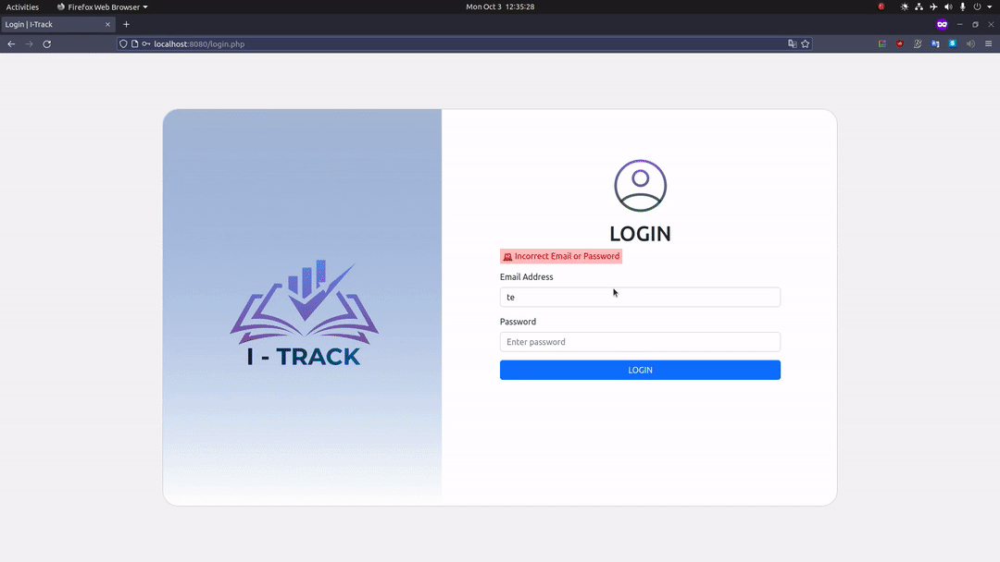

# I-Track: A Student Progress Tracker

A Student Progress Tracker is an application built for students to track their performance progress using the productivity mobile application. Tracking and monitoring student performance are essential in giving information that can be used to help students make decisions that will improve their progress. This would not only allow students to take more ownership of their learning but would also allow them to track their growth over time.

This repository contains the web application for our `I-Track` school project.



## Prerequisites

- Docker
  - In Windows or Mac, simply install [Docker Desktop](https://www.docker.com/products/docker-desktop/)
  - In Ubuntu, install [docker-engine and docker-compose](https://docs.docker.com/engine/install/ubuntu/)

- PostgreSQL database (local or cloud)

## Setup

- Clone the repository
  - `git clone https://github.com/SchadenKai/I-Track-Web.git`

- Navigate to the folder
  - `cd /path/to/I-Track-Web`

- Create `app/credentials.ini` file and write the credentials of your PostgreSQL database

  ```ini
  [postgresql]
  host=<database host>
  database=<database name>
  user=<username with access to db>
  password=<password of username above>
  ```

- While in root `I-Track-Web` directory, build and run the image

  - `docker-compose build`
  - `docker-compose up -d`

- Open browser and navigate:

  - `http://localhost:8000`

- Log in with user credentials stored in `users` table of your PostgreSQL database

- Shut down the web application

  - `docker-compose down`
