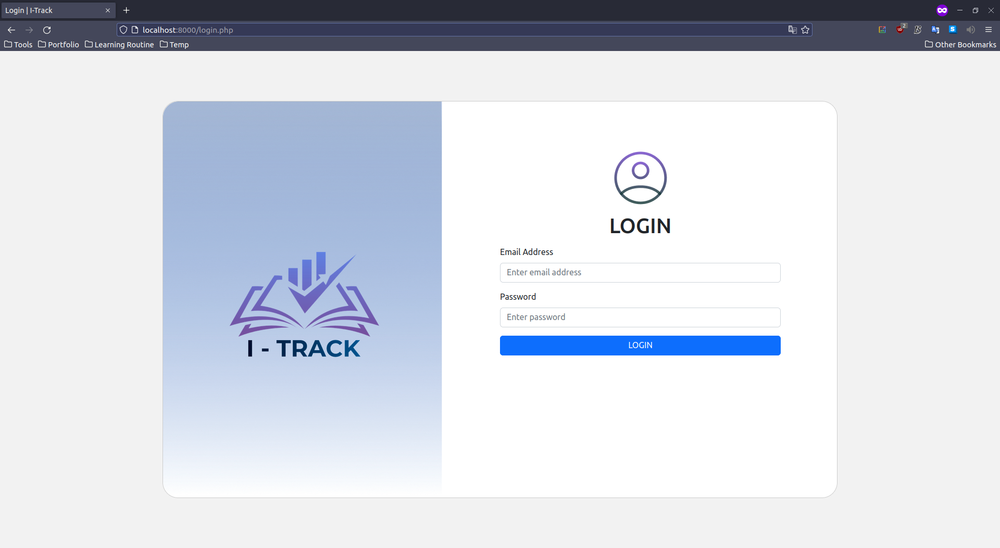

# I-Track: A Student Progress Tracker

A Student Progress Tracker is an application built for students to track their performance progress using the productivity mobile application. Tracking and monitoring student performance are essential in giving information that can be used to help students make decisions that will improve their progress. This would not only allow students to take more ownership of their learning but would also allow them to track their growth over time.

This repository contains the web application for our `I-Track` school project.

## Prerequisites

- Have PHP and the PostgreSQL package `php-pgsql` installed 
  - In Ubuntu:
    - `sudo apt install php libapache2-mod-php php-pgsql`

## Setup

- Clone the repository
  - `git clone https://github.com/SchadenKai/myApp.git`
- Navigate to the folder
  - `cd /path/to/myApp`
- Fire up a PHP server on your device in a given port (e.g. `8000`)
  - `php -S localhost:8000`
- Open browser and navigate to `http://localhost:8000`
